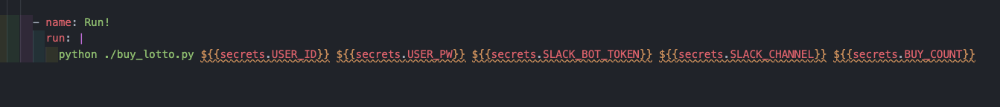
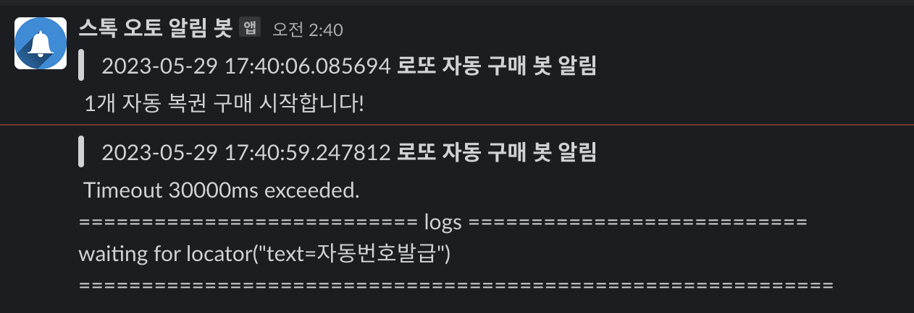

# Buying Lottery by Github Actions
> ***매주 토요일 KST 08:50 에 동행 복권 로또 구매***
- https://dhlottery.co.kr/ 동행복권 홈페이지
- https://velog.io/@king/githubactions-lotto 원작자분 벨로그입니다!
    - 해당 레포는 원작 소스 코드 기반으로 (1)public 하게 사용할 수 있게, (2) slack hook (3) 여타 info check 첨가 정도가 추가가 되었습니다.
- public 으로 공유할 수 있게 모든 민감 정보 action secrets 값으로 관리
- 예치금 필요함!
- slack bot을 통해 slack noti (hook) 전달함

## GETTING START

1. fork를 과감하게 한다.

2. fork한 repo를 `git clone` 한다.

3. slack bot 세팅은 알아서 하고, 사용하지 않는다면 그냥 주석처리해도 된다.

4. `action.yml` 파일을 보면 gitaction 시크릿값을 python run 인자로 넘길때 사용하고 있다. 즉 시크릿값만 세팅하면 된다.

5. 시크릿값은 아래 사진 참고

- slack bot token은 `xoxb` 로 시작하는, bot OAuth token값이다.
- slack channel 값은 추가한 slack bot을 초대한 그 채널값이 필요하다.
- BUY_COUNT가 구매할 복권 수 세팅 값이다.
- 그 외 user값은 https://dhlottery.co.kr/common.do?method=main 여기 회원가입한 정보를 넣자. ***절대 절대 절대 노출 안되게 조심***

6. 위 세팅 완료 후 test를 위해 `action.yml` 에서 `on: [push]` 로 바꾸고 push를 해보자

## STACK
- python
    - Playwright & selenium (chrome driver)
    - requests
    - playwright
- lint: flask8 & black
- github action (action.yml)