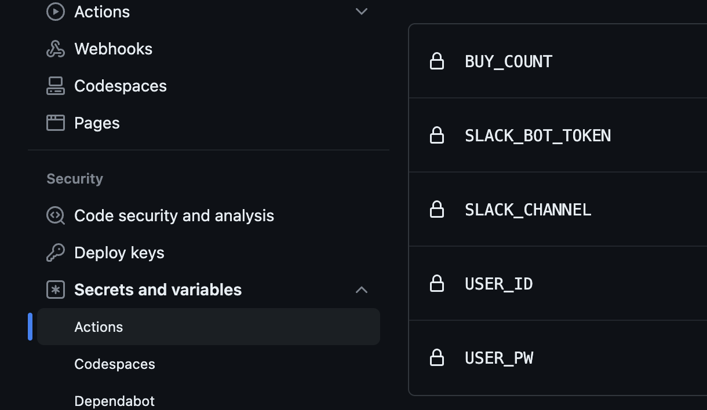
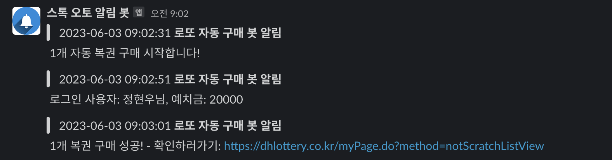
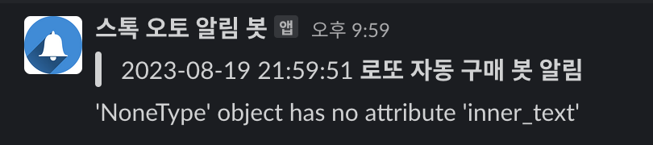

# Buying Lottery automatically by Github Actions
> ***매주 토요일 KST 08:50 에 동행 복권 로또 구매***  
> ***매주 토요일 KST 21:50 에 동행 복권 로또 결과 slack hooking***
- https://dhlottery.co.kr/ 동행복권 홈페이지
- https://velog.io/@king/githubactions-lotto 원작자분 벨로그입니다!
    - 해당 레포는 원작 소스 코드 기반으로 (1)public 하게 사용할 수 있게, (2) slack hook (3) 여타 info check 첨가 정도가 추가가 되었습니다.
- public 으로 공유할 수 있게 모든 민감 정보 action secrets 값으로 관리
- 예치금 필요함!
- slack bot을 통해 slack noti (hook) 전달함

## GETTING START

#### 1. `fork`를 한다!

#### 2. `fork`한 repo를 `git clone` 한다.

#### 3. slack bot 세팅은 아래 글 참조, 사용하지 않는다면 그냥 주석처리해도 된다.
- https://yunwoong.tistory.com/129 최신글 참고 추천!
- slack python SDK를 사용하는 것이 아니라 restAPI Http call을 한다.

#### 4. `action.yml` 파일을 보면 gitaction 시크릿값을 python run 인자로 넘길때 사용하고 있다. 즉 시크릿값만 세팅하면 된다.

#### 5. 시크릿값은 아래 사진 참고

- slack bot token은 `xoxb` 로 시작하는, bot OAuth token값이다.
- slack channel 값은 추가한 slack bot을 초대한 그 채널값이 필요하다.
- BUY_COUNT가 구매할 복권 수 세팅 값이다.
- 그 외 user값은 https://dhlottery.co.kr/common.do?method=main 여기 회원가입한 정보를 넣자. ***절대 절대 절대 노출 안되게 조심***

#### 6. 위 세팅 완료 후 test를 위해 `action.yml` 에서 `on: [push]` 로 바꾸고 push를 해보자

- 러닝할 때 구매가능 여부 부터 체크 해야한다! 구매 가능한 시간대가 아니라면 Timeout error가 날 수 있다.
- 그리고 2번째 사진은 이미 결과 발표가 난 후라 낙첨이 보인다ㅎㅎ 원래 배치로 돌리면 안보일 것 이다.

#### 7. `action-result.yml` 은 이제 발표된 추첨 번호를 slack을 통해 전달해준다. 20시 35분경 발표가 나는 점, 업데이트가 나중에 되는점을 참작해 21시 50분경에 러닝하게 했다.

- 자동으로 번호 비교 기능은 개발하지 않을 예정이다. 적어도 비교하는 재미는 잃지 않도록!

## To develop something more in the local

1. 가상환경 구성을 추천한다. 편한대로 구성하면 된다, ex. `python3 -m venv .venv`
2. `requirements.txt` file을 install 한다.
3. `playwright install` 를 해준다. 기본 준비 끝 - https://playwright.dev/
4. 디버깅 모드 셀레니움이 익숙한 사람은 그렇게 사용해도 무방하다.

## LOG
- [x] 발표난 당첨 번호와 자동 비교 work flow 추가 ~~[23.06.03]~~
- [x] 랜덤으로 구매한 복권 번호, 우선 최대 5개 까지만, 번호 noti work flow 추가 ~~[23.06.25]~~
- `23.06.25` 누적 1만원 소비, MAX Match number = 2개 🥲

## STACK
- python
    - Playwright & selenium (chrome driver)
    - requests
    - playwright
- lint: flask8 & black
- github action (action.yml)